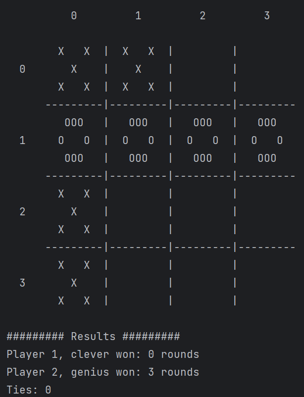

# Exercise 1 - Tic Tac Toe Tournament

### Introduction

_Chatter Bot is an exercise from Huji's Introduction to Object-Oriented Programming course._
This exercise implements a simple chatbot, and helped me get comfortable with foundational coding concepts while building an interactive program.




---

## How to Run

To run the project on your local machine, follow these steps:

1. **Clone the repository**  
   Open a terminal and enter the following command to clone the project:
    ```bash
    git clone <url>
    ```

2. **Open the project**  
   Launch your preferred IDE and open the cloned project directory.

3. **Set up the JDK**  
   Ensure you're using **JDK 11** to compile the source files.

4. **Build and Run**  
   and run the application from your IDE, use this command structure:

   java Tournament [round count] [size] [win_streak]
   [render target: console/none]
   [first player: human/whatever/clever/genius]
   [second player: human/whatever/clever/genius]
