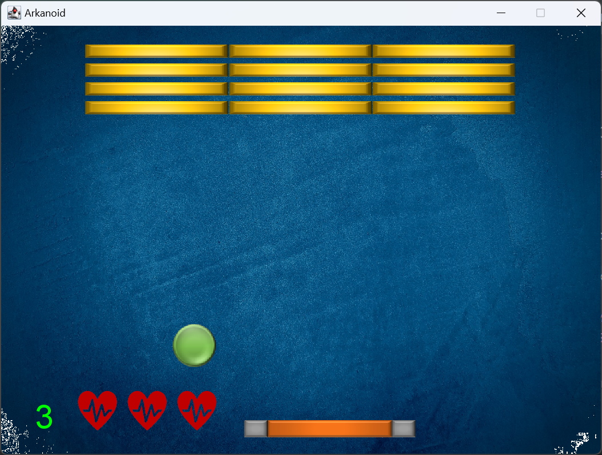

# Exercise 2 - Arkanoid

### Introduction

*Arkanoid* is an exercise from HUJI's "Introduction to Object-Oriented Programming" course. 

This project involves creating an Arkanoid game with exciting enhancements and features that elevate the standard version, making it more interactive and engaging.

Each brick might contain a suprising new element that would be added to the game, give it a try!

Working on this project deepened my understanding of OOP principles, especially in how to approach problem-solving through better design strategies.



---

## How to Run

To run the project on your local machine, follow these steps:

1. **Clone the repository**  
   Open a terminal and enter the following command to clone the project:
    ```bash
    git clone <url>
    ```

2. **Open the project**  
   Launch your preferred IDE and open the cloned project directory.

3. **Set up the JDK**  
   Ensure you're using **JDK 11** to compile the source files.

4. **Build and Run**  
   Run the application from your IDE.

