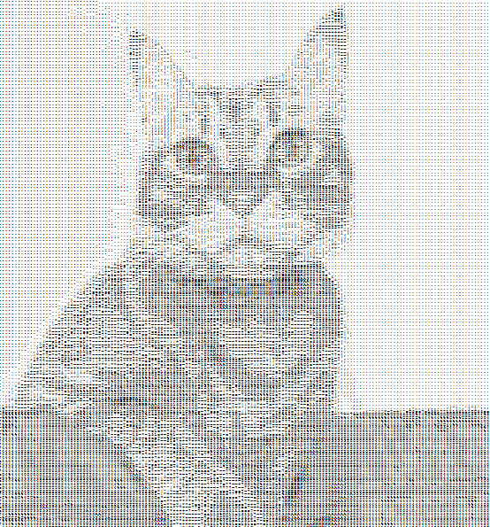

# Exercise 3 - Ascii Art

### Introduction

*Ascii Art* is an exercise from HUJI's "Introduction to Object-Oriented Programming" course. 

This project involves creating a program that can convert a picture to a html file containing ascii charcters chosen by the user.





---
### Running the Application

To run the application, follow these steps in your IDE:

1. **Command Line Instructions:**
   - To add a specific character for the ASCII art, use:
     ```
     add <char>
     ```
   - To add all characters, simply type:
     ```
     add all
     ```
   - To remove a specific character, use:
     ```
     remove <char>
     ```
   - To remove all characters, type:
     ```
     remove all
     ```

2. **Adjusting Resolution:**
   - To change the resolution of the output image, use:
     ```
     res up
     ```
     or
     ```
     res down
     ```

3. **Using Your Own Image:**
   - To try the program with your own image, enter:
     ```
     image <relative image path>
     ```

4. **Output Options:**
   - The default output is displayed in the console. For a nicer presentation, you can use:
     ```
     output html
     ```
     This will generate an output file named `out.html`.

5. **Running the Program:**
   - Finally, execute the ASCII art generation by typing:
     ```
     asciiArt
     ```
   - The output will be printed to the designated output file.

## How to Run

To run the project on your local machine, follow these steps:

1. **Clone the repository**  
   Open a terminal and enter the following command to clone the project:
    ```bash
    git clone <url>
    ```

2. **Open the project**  
   Launch your preferred IDE and open the cloned project directory.

3. **Set up the JDK**  
   Ensure you're using **JDK 11** to compile the source files.

4. **Build and Run**  
  Run the application from your IDE.
  
